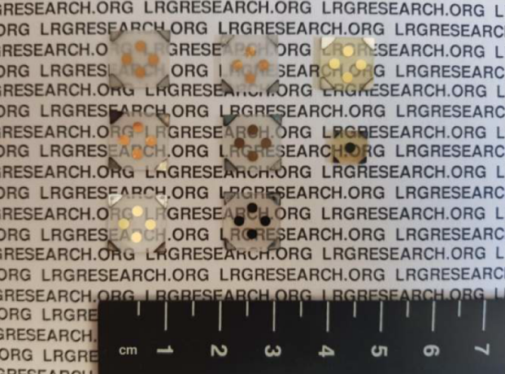

## DEHA- Investigation of Growth Behaviors and 2DEG Properties of of MgZnO/ZnO Heterostructures grown by USPECVD

### Project Information
* Date: Feb 2017 - Feb 2020
* Funded by: TUBITAK
* Number: 116F197
* Budget: 359.810 Turkish liras

### Project Description

Wide-bandgap (WBG) semiconductors is seen as an essential future technology by the U.S. Department of Energy (DOE), introduced as the main technology in recovering 90% of the energy losses, and accepted as a fundamental technology in the future in communication and lighting, particularly in Light Emitting Diodes (LEDs) and LASERs.

Wurtzite crystal structure GaN-based single-crystal semiconductor shows the best application examples among the most of the WBGs. GaN-based High Electron Mobility Transistors (HEMTs) are high-power transistors, which can operate under high temperature and high radiation, and as a result of these characteristics, they are widely used in satellites, radars, and military applications. Optoelectronic devices such as LED, LASER, and photodiodes are among the important application areas. Solar-blind UV missile detectors, ultraviolet light sources and similar devices can be produced through the wurtzite GaN-based optoelectronics.

ZnO-based electronics is another important WBG electronics material group. Both due to its nature and crystalline structure, ZnO-based electronics has significant similarities with the GaN-based electronics. The growth of ZnO derivatives was carried out by methods such as sol-gel, dip-coating and dispersion, yielding large quantities of material for applications such as transparent electrical contacts, diodes, and solar cells up to now. These methods are inexpensive and non-toxic as well as yielding a wealth of production. In the literature, however, there have been better quality (single-crystal) crystal growth techniques reported for ZnO derivatives (see the Subject, Scope and Literature Summary). The molecular beam epitaxy (MBE) and metalorganic chemical vapor deposition (MOCVD) are among these methods. These methods are also used in GaN-based electronics for high-quality crystal production. The MBE system is a very complex and expensive growth method since it uses expensive vacuum hardware and pure elements. MOCVD, however, needs extensive safety equipment due to the metalorganic toxic gases used. Both methods use expensive equipment and expensive consumables.

At this point, the ultrasonic spray CVD (USCVD) method comes to the fore for the growth of ZnO derivatives. In this method, a simple precursor material is dissolved in a solution and put into a CVD furnace with a harmless carrier gas after turning into a cold steam through an ultrasonic vibrating crystal. Successful growth of single-crystalline/polycrystalline materials such as ZnO and MgZnO using this method has been reported in the literature.

Not only the ZnO derivatives but also the heterostructures can be grown with this method by growing in order. Of these multiple structures, the most notable is the MgZnO/ZnO. The MgZnO/ZnO heterostructure is very similar to the AlGaN/GaN heterostructure in terms of crystalline structure and electrical properties. With these properties, it stands out as a significant option for producing HEMTs, ultraviolet LEDs, LASER and detectors that can compete with GaN-based electronics. As far as we know, simple, inexpensive, non-toxic, and eco-friendly USCVD method has not been used for the growth of the high-speed, high-power, and high-temperature-and-radiation-resistant MgZnO/ZnO multiple structure yet. Other than that, introduction of a plasma into the reactor is a known method accelerating the reaction in CVD growths. This type of CVD systems are called plasma-enhanced CVD (PECVD). Similarly, as far as we know Ultrasonic Spray Plasma-Enhanced CVD (USPECVD) has not been realized yet in conventional CVD systems.

### Objectives

This project proposal will begin with ZnO, MgZnO and n-type doped MgZnO growths in cubic and hexagonal crystal symmetries, similar to the growths in the literature. The project aims to grow MgZnO/ZnO and n-MgZnO/ZnO hetero structures with the USCVD and USPECVD methods for the first time, as an authentic contribution to the literature. In this way, as mentioned above, we plan to produce high-speed, high-power, and high-temperature-and-radiation-resistant devices, which can compete with GaN-based electronics in the future, by using a simple, inexpensive, non-toxic, and eco-friendly crystal growth method. The successful completion of the project will pave the way for many new projects, collaborations, publications and patents on various devices such as LEDs, LASERs and photodetectors in the future.

### Project Consortium

#### Project Team
* Prof. Dr. Sefer Bora LISESIVDIN (PI) (Gazi Univ.)
* Prof. Dr. Abdullah YILDIZ (Ankara Yildirim Beyazit Univ.)
* Abdullah ATILGAN (Ankara Yildirim Beyazit Univ.)
* Ece KUTLU-NARİN (Ankara Yildirim Beyazit Univ.)
* Polat NARİN (Gazi Univ.)

#### Other Colleagues, Students and Collaborations
* Prof. Dr. Mehmet KASAP (Gazi Univ.)
* Prof. Dr. Ekmel OZBAY (Bilkent Univ.)
* Assoc. Prof. Dr. Beyza SARIKAVAK-LISESIVDIN (Gazi Univ.)
* Dr. Gokhan ATMACA (Gazi Univ.)
* Jangeez M. All ABBAS (Gazi Univ.)
* Meltem YAYLA (Gazi Univ.)
* Rokaia IBRAHEM (Gazi Univ.)

### Project Structure
* WP1: Computational investigation of the effect of Li, K, Rb and Cs impurities on the electronic and optical properties of MgZnO crystal
* WP2: Establishment of growth system, supply of substrate, gas and chemicals
* WP3: Optimization of the system for ZnO and MgZnO in USCVD mode (Soda-lime and Si/SiO2)
* WP4: Wurtzite ZnO, MgZnO, and doped growths on wurtzite substrate in USCVD mode
* WP5: Wurtzite MgZnO/ZnO multistructure and associated MODFET growths on wurtzite substrate in USCVD mode
* WP6: Advanced 2DEG characterizations 1
* WP7: Optimizing the system for ZnO and MgZnO in USPECVD mode (Wurtzite, sapphire)
* WP8: Wurtzite MgZnO/ZnO multistructure and associated MODFET growths on wurtzite substrates in USPECVD mode
* WP9: Advanced 2DEG characterizations 2

### Project News*

#### September 2021
* New proceeding from our project: P. Narin, E. Kutlu-Narin, S. B. Lisesivdin “Structural and Optical Properties of ZnO Nanoplatelet Structure Grown by Mist-CVD” p240, Turkish Physical Society 37th International Physics Congress, September 1-5 2021, Bodrum, Turkey.
* New proceeding from our project: M. Yayla, S. B. Lisesivdin, M. Kasap “Determination of Structural and Electrical Properties of ZnO Thin Films Grown By Mist-Cvd Method on Sapphire with Different Orientations” p236, Turkish Physical Society 37th International Physics Congress, September 1-5 2021, Bodrum, Turkey.

#### April 2021
* New article from our project: E. Kutlu, P. Narin, A. Yildiz, S. B. Lisesivdin “Effect of magnesium content and growth temperature on structural and optical properties of USCVD-grown MgZnO films” Appl. Phys. A 127, 367 (2021).
* New article from our project: P. Narin, E. Kutlu-Narin, S. B. Lisesivdin “Growth dynamics of mist-CVD grown ZnO Nanoplatelets” Physica B 614, 413028 (2021).

#### February 2020
* Project is finished.
* New article from our project: E. Kutlu, P. Narin, A. Yildiz, S. B. Lisesivdin “Effects of Annealing under Different Atmospheres on Structural and Optical Properties of USCVD grown ZnO Nanostructures” Mater. Sci. Eng. B 254, 114506 (2020).

#### November 2019
* New article from our project: R. Ibrahem, P. Narin, S. B. Lisesivdin, E. Ozbay “Investigation of electronic and optical properties of wurtzite MgZnO using GGA + U formalism”, Philos. Mag. Lett. 99, 424 (2019).

#### December 2018
* New article from our project: J. M. All Abbas, P. Narin, E. Kutlu, S. B. Lisesivdin, E. Ozbay “Electronic properties of Zigzag ZnO nanoribbons with Hydrogen and Magnesium passivations” Physica B 556, (2019).

#### September 2018
* New proceeding from our project: J. M. All Abbas, P. Narin, E. Kutlu, S. B. Lisesivdin, E. Ozbay “First Principle Study of ZnO Nanoribbon Passivated with H and Mg” 20th National Workshop on Optics, Electro-optics and Photonics, Ankara, P37, (2018).
* New proceeding from our project: E. Kutlu, P. Narin, A. Yildiz, S. B. Lisesivdin “Structural and Optical Properties of MgxZn1-xO Nanostructures Depending on Growth Temperatures” 20th National Workshop on Optics, Electro-optics and Photonics, Ankara, P31, (2018).
* New proceeding from our project: E. Kutlu, P. Narin, A. Yildiz, S. B. Lisesivdin “Effect of Transducer Power on Optical and Structural Properties of ZnO Nanostructures” 20th National Workshop on Optics, Electro-optics and Photonics, Ankara, P30, (2018).
* New proceeding from our project: P. Narin, E. Kutlu, S. B. Lisesivdin, E. Ozbay “Growth of ZnO Nanostructures on Sapphire by Ultrasonic Spray CVD” 20th National Workshop on Optics, Electro-optics and Photonics, Ankara, P29, (2018).
* New proceeding from our project: P. Narin, E. Kutlu, S. B. Lisesivdin, “Optical and Structural Properties of ZnO Grown by Mist CVD Using Different Precursor Molarity” 20th National Workshop on Optics, Electro-optics and Photonics, Ankara, P28, (2018).
* New proceeding from our project: R. Ibrahem, P. Narin, S. B. Lisesivdin, E. Ozbay “First-Principles Calculation of Optical Properties of Magnesium Zinc Oxide” 20th National Workshop on Optics, Electro-optics and Photonics, Ankara, P14, (2018).

#### April 2018
* New article from our project: P. Narin, E. Kutlu, G. Atmaca, A. Atilgan, A. Yildiz. S. B. Lisesivdin, “Structural and optical properties of hexagonal ZnO nanostructures grown by ultrasonic spray CVD” Optik 168, 86-91 (2018).

#### February 2017
* Project is started.

*: Project site is prepared after project was finished.
